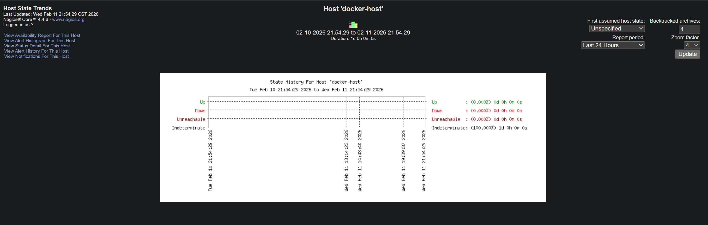
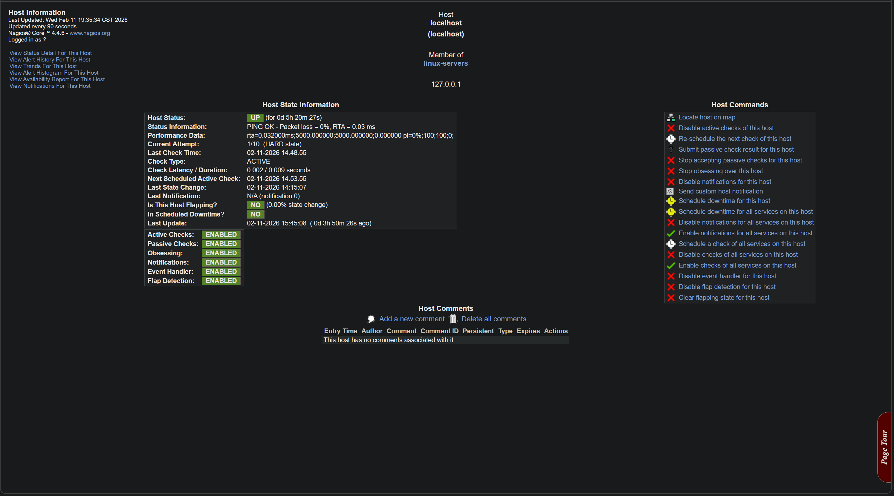
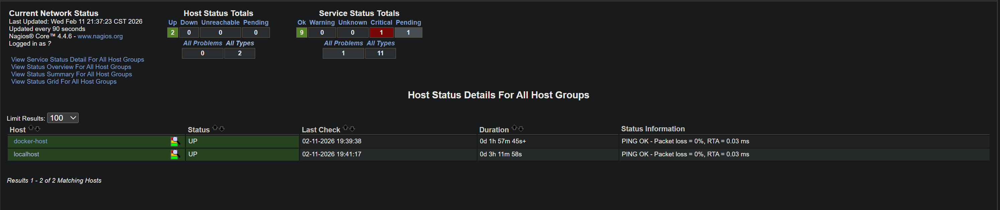
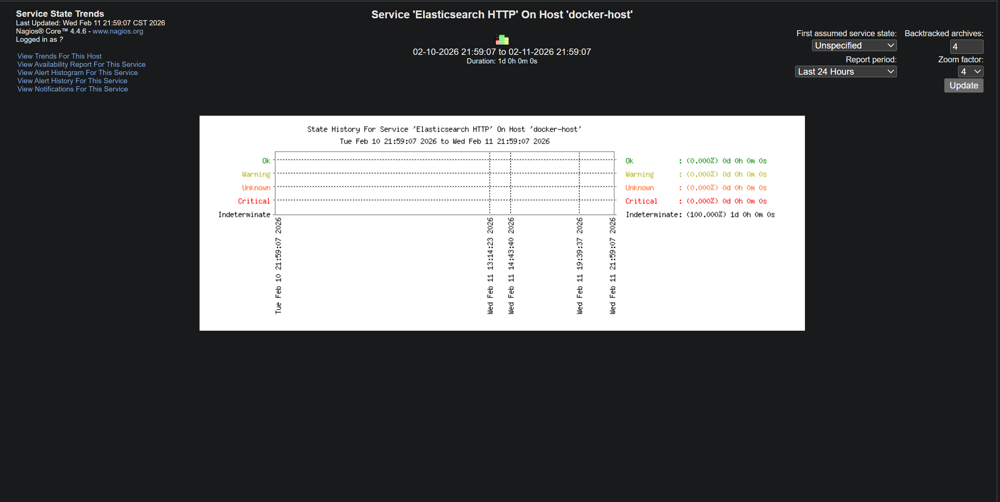
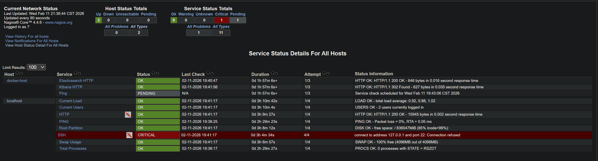
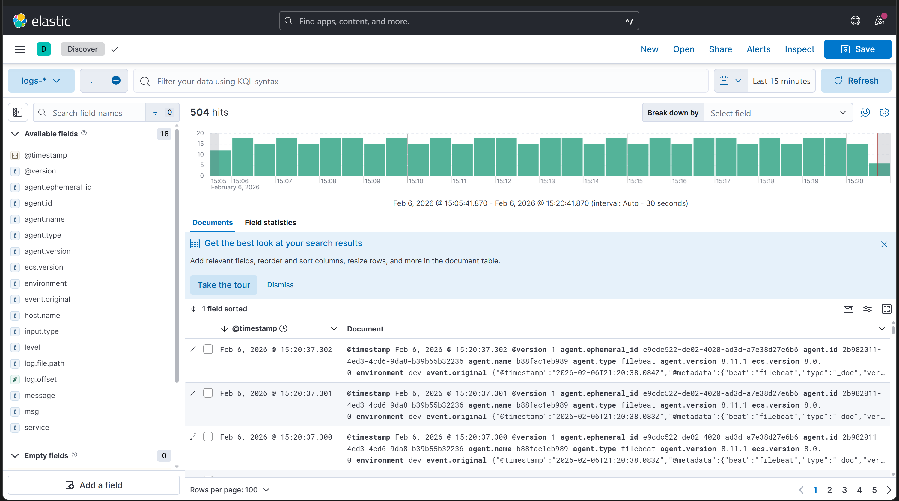
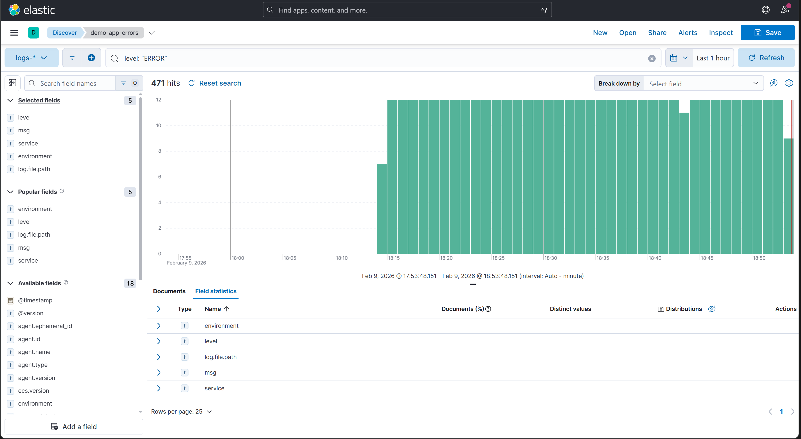

# Centralized Logging & Monitoring System

## Introduction

This project implements a centralized logging and monitoring stack for a demo application using Filebeat → Kafka → Logstash → Elasticsearch → Kibana, with Nagios Core providing host and service health monitoring. All components run in Docker on localhost, demonstrating how to collect, transport, process, visualize, and monitor logs in a way that can scale to production.

---
## Table of Contents

1. Project Overview
2. Architecture
3. Tools & Services
4. Getting Started
5. Kibana Dashboards & Visualizations
6. Features & Key Notes
7. Alerting
8. Securing the Stack
9. Future Improvements

---

## Project Overview

The goal of this project is to build a fully containerized centralized logging stack for a sample application that writes structured logs to a file. Logs are shipped with Filebeat, sent through Kafka as an event bus, processed by Logstash, stored in Elasticsearch, and explored in Kibana Discover views and saved searches.

On top of that, Nagios Core monitors the Elasticsearch and Kibana containers to validate that the infrastructure behind the logging pipeline is reachable and healthy.

The main objectives are:
* Collect application logs from a Dockerized app in a consistent, structured format.
* Use Kafka as a reliable transport layer between log shippers and log processors.
* Parse, enrich, and index logs into Elasticsearch for fast querying.
* Build Kibana searches/visualizations to analyze INFO/WARNING/ERROR events.
* Use Nagios to monitor service availability for the same environment.

---

## Architecture

```
app/app.py  ->  logs/app.log  ->  Filebeat  ->  Kafka (app-logs)  ->  Logstash  ->  Elasticsearch  ->  Kibana
                                                                                          ^
                                                                                Nagios (HTTP health checks)
```

* `app/app.py` – Demo application that generates synthetic log lines (`INFO`, `WARNING`, `ERROR`), each carrying a `user_id` and/or `latency_ms` value, and writes them to `/logs/app.log` inside the container.
* `filebeat/filebeat.yml` – Configures Filebeat to tail `/logs/app.log`, add ECS metadata, and publish events to the Kafka topic `app-logs`.
* `logstash/pipeline/logstash.conf` – Consumes from Kafka (`app-logs`), parses each log message into fields like `level`, `msg`, `user_id`, and `latency_ms`, normalizes timestamps, and outputs to Elasticsearch indices `logs-YYYY.MM.DD`.
* `nagios/conf.d/elk-services.cfg` – Custom Nagios host/service definitions that `check_http` the Elasticsearch (`:9200`) and Kibana (`:5601`) containers.
* `elasticsearch/watcher/high-error-rate-watch.json` – Example Elasticsearch Watcher that flags spikes in `ERROR` events (see [Alerting](#alerting)).
* `docker-compose.yml` – Orchestrates all services (app, Filebeat, Kafka, Logstash, Elasticsearch, Kibana, Nagios) on a local Docker network and exposes ports for Elasticsearch (`9200`), Kibana (`5601`), Kafka (`9092`), and Nagios (`8080`).
* `logs/` – Bind-mounted directory where the app writes `app.log` and Filebeat reads it from; contents are gitignored so a fresh clone starts empty.

---

## Tools & Services

* Docker / Docker Compose – Container orchestration for the full stack.
* Demo App (Python) – Writes synthetic `INFO`, `WARNING`, and `ERROR` messages to `/logs/app.log`.
* Filebeat 8.11 – Lightweight shipper that tails the log file and sends JSON events to Kafka using ECS-compatible fields.
* Apache Kafka (KRaft mode, no Zookeeper) – Distributed log/event bus decoupling log producers (Filebeat) from consumers (Logstash).
* Logstash 8.11 – Ingests from Kafka, parses messages with filters, and sends documents to Elasticsearch.
* Elasticsearch 8.11 – Stores and indexes log documents into date-based `logs-*` indices, backed by a named Docker volume so data survives restarts.
* Kibana 8.11 – UI for ad‑hoc search, dashboards, and visualizations over the `logs-*` data.
* Nagios Core 4.x – Monitors HTTP endpoints (Elasticsearch/Kibana) for availability and basic health, exposed on `:8080`.

---

## Getting Started

```bash
git clone https://github.com/by-tayo/elk_stack.git
cd elk_stack
docker compose up -d
```

Wait for services to report healthy, then check:

* Kibana: http://localhost:5601
* Elasticsearch: http://localhost:9200
* Nagios (login `nagiosadmin` / `nagios`, change on first login): http://localhost:8080

In Kibana, create a data view for `logs-*` with `@timestamp` as the time field to start exploring events.

To tear down (and drop persisted Elasticsearch data):

```bash
docker compose down -v
```

---

## Kibana Dashboards & Visualizations

Kibana is used primarily through Discover and saved searches:

**Error‑focused Discover view** – the saved search `demo-app-errors` filters on `level: "ERROR"`.









---

## Features & Key Notes

* End‑to‑end centralized logging pipeline
  - Logs collected from a containerized application and shipped via Filebeat.
  - Kafka (KRaft mode) used as a decoupling layer between producers and consumers, with no external Zookeeper dependency.
* Structured, queryable logs
  - Logs enriched with ECS fields: `@timestamp`, `service`, `environment`, `host.name`, `agent.*`, etc.
  - Custom fields extracted: `level` (INFO/WARNING/ERROR), `msg`, `user_id`, and `latency_ms`.
* Kafka verification
  - `docker exec` into the Kafka container and use `kafka-console-consumer` to read raw events from the `app-logs` topic.
  - Observe a continuous stream of JSON messages matching the app log patterns and offsets.
* Elasticsearch indexing
  - Documents stored in indices with correctly parsed fields and timestamps, persisted across restarts via the `esdata` volume.
* Kibana analytics
  - Data view `logs-*` with `@timestamp` as the time field.
  - Saved search `demo-app-errors` filtering on `level: "ERROR"`.
  - Dashboard `centralized-logging-dashboard` embedding the saved search for quick error monitoring.
* Service health monitoring
  - Docker Compose healthchecks gate startup ordering (Logstash/Kibana wait on Elasticsearch and Kafka to report healthy).
  - Nagios independently polls Elasticsearch and Kibana over HTTP and surfaces state/trend history in its own UI.

---

## Alerting

An example Elasticsearch Watcher is included at [`elasticsearch/watcher/high-error-rate-watch.json`](elasticsearch/watcher/high-error-rate-watch.json). It runs every minute, counts `ERROR` events in `logs-*` over the last 5 minutes, and logs an alert when the count reaches 10+.

Load it via Kibana Dev Tools console (or `curl`) once the stack is up:

```
PUT _watcher/watch/high-error-rate
<paste the contents of high-error-rate-watch.json as the request body>
```

The default action just writes to the Elasticsearch/Watcher log — swap the `logging` action for an `email` or `webhook` (e.g. Slack) action to get real notifications; see the [Elastic Watcher actions docs](https://www.elastic.co/guide/en/elasticsearch/reference/current/actions.html) for the connector config.

---

## Securing the Stack

This project runs with `xpack.security.enabled=false` and no TLS by default, which keeps local setup friction-free but is **not** suitable for anything beyond localhost use. To harden it for shared or production use:

1. Set `xpack.security.enabled=true` on Elasticsearch and Kibana, and generate certificates with `elasticsearch-certutil` (or mount your own).
2. Set passwords for the built-in users via `elasticsearch-setup-passwords` and configure Kibana with a service account/API key rather than a superuser.
3. Put TLS in front of Kafka (`SASL_SSL` listeners) if Filebeat/Logstash cross an untrusted network.
4. Restrict Nagios's default `nagiosadmin`/`nagios` credentials immediately, and put it behind a reverse proxy with its own TLS termination.

---

## Future Improvements

* Add Kibana dashboards (bar charts by log level, pie charts by service, etc.) as exportable saved objects.
* Wire the Watcher alert (or Kibana's own alerting rules) up to a real notification channel (email/Slack).
* Deploy to Kubernetes, Docker Swarm, or Elastic Cloud for higher availability and scale.
* Integrate Nagios notifications (email/Slack) for critical outages and correlate them with Kibana error spikes.
* Add log rotation for `logs/app.log` so long-running local demos don't grow the file unbounded.
